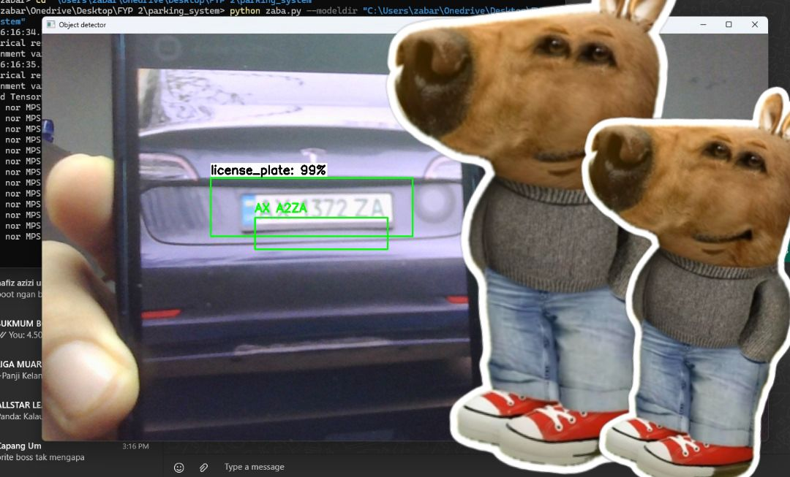

# 🚗 Smart IoT Parking System with License Plate Recognition

## 📝 Overview

This is an **IoT-based smart parking system** that uses **license plate detection and recognition** to automate vehicle entry. Only **authorized vehicles** (those registered in the system) will be allowed to enter the parking area by automatically lifting the gate. The system is connected to a **web-based dashboard** that enables administrators to monitor, register, and remove plate numbers in real-time.

### 🔔 Features:
- Automatically detects and reads license plates.
- Grants access only to registered vehicles.
- Real-time notifications for allowed and denied entries.
- Web dashboard for admin to:
  - View entry logs.
  - Receive entry notifications.
  - Register or delete license plate numbers.
  - Control the poll (for soecial granted such as VIP)

---

## 🔧 Hardware Requirements

- **Raspberry Pi 4**
- **Servo Motor** (for gate control)
- **Ultrasonic Sensor / IR Sensor** (to detect vehicle position)
- **Pi Camera** *(latest model recommended for better clarity)*

---

## 🧠 Object Detection and OCR

This project goes beyond basic object detection — it **detects and reads license plate numbers** using **OCR (Optical Character Recognition)** technology integrated with object detection.

### 🛠️ OCR Libraries Considered:
- EasyOCR ✅ *(Used in this project)*
- PyTesseract
- tesserocr
- libtesseract
- pyocr

After testing several options, **EasyOCR** was chosen due to its excellent accuracy, even if there's a slight lag during detection. The lag occurs because the camera continuously detects and reads objects, but it usually lasts only a few seconds. To minimize repeated detection, a **5-second buffer** is implemented after successfully reading a plate.

📦 Install EasyOCR:
```bash
pip install easyocr
```



---

## 🔗 System Workflow

1. **Camera continuously monitors for vehicles.**
2. **Object Detection** identifies the license plate.
3. **EasyOCR** reads the text on the plate.
4. The plate number is **checked against a MongoDB database**.
5. If the number is **registered**:
   - The gate (controlled by a servo) opens.
   - An **IR sensor** ensures the car has fully passed through before closing.
   - A **notification** is sent to the admin dashboard.
6. If the number is **not registered**, entry is denied and a notification is still sent.

### 💾 Database:
- **MongoDB** is used to store registered plate numbers.
- It’s fast, flexible, and ideal for IoT applications.

---

## 📊 Admin Dashboard

The dashboard allows administrators to:
- Monitor all vehicle entries and exits.
- View logs of authorized and denied attempts.
- Receive real-time notifications.
- Add or delete license plate numbers from the database.

---

## 🖥️ Software Stack

- **Python** (for object detection and hardware interaction)
- **MongoDB** (database for registered plates)
- **EasyOCR** (OCR for plate reading)
- **Flask / Express (optional)** for building the dashboard backend
- **React / HTML+JS (optional)** for the frontend dashboard

---

## 🚀 Future Improvements

- Optimize detection performance to reduce camera lag.
- Add facial recognition as a secondary authentication.
- Enable mobile app integration for real-time access logs.
- Integrate payment systems for commercial parking lots.

---

## 📬 Contact

For questions, support, or collaboration, feel free to reach out:

📧 **aimanazim539@gmail.com**
